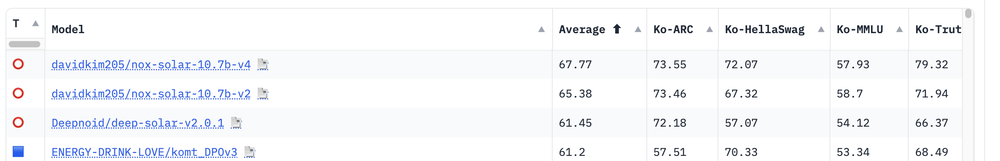

# nox
Efficient fine-tuning for ko-llm models.


## News or Update
### 2024.03.15
- upstage/open-ko-llm-leaderboard 1위 (2024/03/15) https://huggingface.co/spaces/upstage/open-ko-llm-leaderboard


## Hardware and Software
- nvidia driver : 535.86.10
- CUDA Version: 12.2
### GPU Memory
| Method          | gpu memory |
| --------------- | ---------- |
| SFT LoRA 16bits | 23GB       |
| SFT QLoRA 8bits | 20GB       |
| SFT QLoRA 4bits | 9GB        |
| DPO LoRA 16bits | 25GB       |
| DPO QLoRA 8bits | 21GB       |
| DPO QLoRA 4bits | 10GB       |
## Released Model Checkpoints
### [davidkim205/nox-solar-10.7b-v4](https://huggingface.co/davidkim205/nox-solar-10.7b-v4)
| Model                          | Average | Ko-ARC | Ko-HellaSwag | Ko-MMLU | Ko-TruthfulQA | Ko-CommonGen V2 |
| ------------------------------ | ------- | ------ | ------------ | ------- | ------------- | --------------- |
| davidkim205/nox-solar-10.7b-v4 | 67.77   | 73.55  | 72.07        | 57.93   | 79.32         | 55.96           |
### [davidkim205/nox-solar-10.7b-v2](https://huggingface.co/davidkim205/nox-solar-10.7b-v2)
| Model                          | Average | Ko-ARC | Ko-HellaSwag | Ko-MMLU | Ko-TruthfulQA | Ko-CommonGen V2 |
| ------------------------------ | ------- | ------ | ------------ | ------- | ------------- | --------------- |
| davidkim205/nox-solar-10.7b-v2 | 65.38   | 73.46  | 67.32        | 58.7    | 71.94         | 55.49           |
## Datasets
### [davidkim205/kollm-converations](https://huggingface.co/datasets/davidkim205/kollm-converations)
sft학습시 사용되는 데이터셋으로 conversations 형식으로 되어 있습니다.
- 총 1.12M 대화로 구성
### [davidkim205/kollm-comparision](https://huggingface.co/datasets/davidkim205/kollm-comparision)
dpo학습시 시용되는 데이터셋으로 comparsision 형식 되어 있습니다.
- 총 116K 질문과 답변(chosen,rejected)으로 구성
## installation
```
conda create -n nox python=3.10
conda activate nox
pip install -r requirements.txt
```

## Train

### SFT : Supervised Fine-Tuning

#### LoRA
``` 
python train_sft.py \
    --model_name_or_path davidkim205/nox-solar-10.7b-v2 \
    --dataset davidkim205/kollm-converations \
    --output_dir outputs/sft \
    --stage sft\
    --do_train\
    --finetuning_type lora\
    --overwrite_cache\
    --per_device_train_batch_size 16\
    --gradient_accumulation_steps 1\
    --lr_scheduler_type cosine\
    --logging_steps 10\
    --save_steps 100\
    --learning_rate 1e-7\
    --num_train_epochs 3\
    --plot_loss\
    --overwrite_output_dir\
    --bf16\
    --use_fast_tokenizer
  
```
#### QLoRA
```
python train_sft.py \
    --stage sft \
    --do_train \
    --quantization_bit 4 \
    --model_name_or_path davidkim205/nox-solar-10.7b-v2 \
    --dataset davidkim205/kollm-converations \
    --template solar \
    --finetuning_type lora \
    --lora_target all \
    --output_dir outputs/-comp-35k-test-dpo-lora-lr1e-7-e3-b1 \
    --overwrite_cache \
    --per_device_train_batch_size 1 \
    --gradient_accumulation_steps 1 \
    --lr_scheduler_type cosine \
    --logging_steps 10 \
    --save_steps 1000 \
    --learning_rate 1e-7 \
    --num_train_epochs 3 \
    --plot_loss \
    --overwrite_output_dir \
    --use_fast_tokenizer \
    --bf16
```
### DPO : Direct Preference Optimization Trainer
#### LoRA
``` 
python train_dpo.py \
   --stage dpo \
   --do_train \
   --model_name_or_path davidkim205/nox-solar-10.7b-v2 \
   --dataset davidkim205/kollm-comparision \
   --template solar \
   --finetuning_type lora \
   --lora_target all \
   --output_dir outputs/test \
   --overwrite_cache \
   --per_device_train_batch_size 1 \
   --gradient_accumulation_steps 1 \
   --lr_scheduler_type cosine \
   --logging_steps 10 \
   --save_steps 100 \
   --learning_rate 1e-5 \
   --num_train_epochs 1 \
   --plot_loss \
   --overwrite_output_dir \
   --use_fast_tokenizer \
   --bf16
```

#### QLoRA
``` 
python train_dpo.py \
   --stage dpo \
   --do_train \
   --quantization_bit 4 \
   --model_name_or_path davidkim205/nox-solar-10.7b-v2 \
   --dataset davidkim205/kollm-comparision \
   --template solar \
   --finetuning_type lora \
   --lora_target all \
   --output_dir outputs/test \
   --overwrite_cache \
   --per_device_train_batch_size 1 \
   --gradient_accumulation_steps 1 \
   --lr_scheduler_type cosine \
   --logging_steps 10 \
   --save_steps 100 \
   --learning_rate 1e-5 \
   --num_train_epochs 1 \
   --plot_loss \
   --overwrite_output_dir \
   --use_fast_tokenizer \
   --bf16
```
### Load adapter 
`--adapter_name_or_path` 을 추가하면 adapter weight를 load할수 있습니다. 아래는 outputs/sft에 저장된 adapter를 불러오는 예입니다.
``` 
python train_dpo.py \
   --stage dpo \
   --do_train \
   --adapter_name_or_path outputs/sft/
   --quantization_bit 4 \
   --model_name_or_path davidkim205/nox-solar-10.7b-v2 \
   --dataset davidkim205/kollm-comparision \
   --template solar \
   --finetuning_type lora \
   --lora_target all \
   --output_dir outputs/test \
   --overwrite_cache \
   --per_device_train_batch_size 1 \
   --gradient_accumulation_steps 1 \
   --lr_scheduler_type cosine \
   --logging_steps 10 \
   --save_steps 100 \
   --learning_rate 1e-5 \
   --num_train_epochs 1 \
   --plot_loss \
   --overwrite_output_dir \
   --use_fast_tokenizer \
   --bf16
```
## Evaluation
https://github.com/davidkim205/kollm_evaluation


## etc
### template
sft와 dpo 학습은 SOLAR 모델에 기준으로 작성되었기때문에 다른 모델을 사용시 template를 변경해야합니다. preprocess.py의 get_template를 참고하세요.
```
def get_template(user, input='', gpt=''):
    if len(input) >= 1:
        return f"### User:\n{user}\n{input}\n### Assistant:{gpt}\n"
    else:
        return f"### User:\n{user}\n### Assistant:\n"
```

# References
- https://github.com/hiyouga/LLaMA-Factory
- https://github.com/OpenAccess-AI-Collective/axolotl
- https://huggingface.co/blog/dpo-trl


